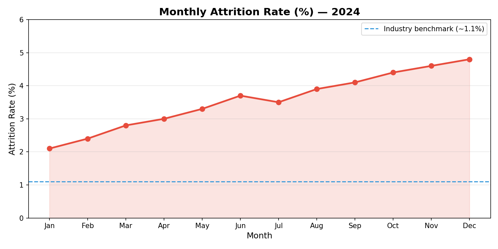

<!-- Slide 1: Title -->
# Employee Attrition & Talent Retention
## An HR Issue Presentation

**Date:** February 25, 2026
**Authors:** HR Team
**Audience:** Executive Leadership & Department Heads

---

<!-- Speaker Note: Slide 1
Welcome everyone. Today we will walk through a significant HR challenge we have been tracking
throughout 2024 and into 2025: a steady rise in employee attrition. We will cover the data,
root causes, and the concrete actions we recommend. The presentation is designed to last 13–15
minutes, followed by open Q&A.
-->

<!-- Slide 2: Executive Summary -->
## Executive Summary

- **Issue:** Employee attrition rose from **2.1% → 4.8%** (Jan–Dec 2024), doubling in 12 months.
- **Impact:** Headcount dropped from **320 → 254** (−21%). Time-to-hire increased to **54 days**.
- **Root Causes:** Compensation gaps, limited career growth, and post-pandemic hybrid-work friction.
- **Recommended Actions:**
  - Immediate salary benchmarking and off-cycle adjustments
  - Structured career-path programme (Q2 2026)
  - Hybrid-work policy refresh (Q1 2026)
- **Decision Needed:** Approve budget for retention initiatives by **March 31, 2026**.

---

<!-- Speaker Note: Slide 2
This slide is the "one-pager" for anyone who needs to leave early or share a summary.
Emphasise the doubling of attrition rate and the headcount decline. Make clear that we are
asking for a budget decision by the end of Q1. The full rationale follows in the remaining slides.
-->

<!-- Slide 3: Background -->
## Background

### Timeline of Events

| Period | Event |
|--------|-------|
| Q1 2023 | Return-to-office policy introduced (3 days/week) |
| Q3 2023 | Market salary surveys flagged 12–18% compensation gap |
| Q1 2024 | First wave of voluntary resignations; attrition at 2.1% |
| Q2 2024 | Attrition accelerates; exit interviews surface recurring themes |
| Q3 2024 | HR taskforce formed; benchmarking study commissioned |
| Q4 2024 | Attrition peaks at 4.8%; 47 open roles unfilled |
| Q1 2026 | This presentation & decision request |

---

<!-- Speaker Note: Slide 3
Walk the audience through the timeline to show this is not a sudden crisis—it has been building.
The return-to-office policy in 2023, the identified compensation gap, and the lack of rapid action
in H1 2024 all contributed. The Q3 taskforce was a positive step, but we need leadership commitment
to act on the findings.
-->

<!-- Slide 4: Current State / Problem Statement -->
## Current State / Problem Statement

- Attrition rate has **doubled** (2.1% → 4.8%) in one calendar year.
- **66 employees** left voluntarily in 2024 (vs. 29 in 2023).
- **47 open roles** remain unfilled as of December 2024.
- Time-to-hire has risen to **54 days** (industry benchmark: ~30 days).
- Knowledge loss is concentrated in **Engineering** (38%) and **Sales** (27%).
- Employee Engagement Score dropped from **74 → 61** (out of 100).

### Key Question
> *Why are employees leaving faster than we can hire replacements, and what must change?*

---

<!-- Speaker Note: Slide 4
Be specific and factual here. Avoid softening the numbers—leadership needs to see the severity.
Mention that engineering and sales are the hardest-hit departments because they also carry the
highest business impact. The engagement score drop corroborates exit-interview themes.
-->

<!-- Slide 5: Impact Analysis -->
## Impact Analysis

### People Metrics

| Metric | Jan 2024 | Dec 2024 | Change |
|--------|----------|----------|--------|
| Headcount | 320 | 254 | −66 (−21%) |
| Attrition Rate | 2.1% | 4.8% | +2.7 pp |
| Time-to-Hire (days) | 28 | 54 | +26 days |
| Open Roles | 12 | 47 | +35 |

### Business Impact

- **Revenue risk:** Each unfilled sales role = ~$180K ARR at risk per quarter.
- **Productivity loss:** Engineering velocity down **23%** (sprints per quarter).
- **Recruitment cost:** Average cost-per-hire ~$8,500; 66 hires needed = **~$561K** in 2024.
- **Morale spiral:** Remaining employees absorbing 25% more workload on average.

---

<!-- Speaker Note: Slide 5
This slide translates people data into business terms that resonate with finance and product leads.
Highlight the revenue risk number—it is the most compelling figure for the C-suite. The $561K
recruitment cost does NOT include productivity loss or training ramp-up time, making the true
cost significantly higher.
-->

<!-- Slide 6: Root Causes -->
## Root Causes

1. **Compensation Gap (High)**
   - Salaries 12–18% below market median across Engineering, Sales, and Product.

2. **Limited Career Visibility (High)**
   - No documented career ladders; 54% of exit interviewees cited "no growth path."

3. **Hybrid-Work Friction (Medium)**
   - Rigid 3-day-per-week mandate vs. competitor flexibility; cited by 41% of leavers.

4. **Manager Effectiveness (Medium)**
   - 1:1 cadence below target in 6 of 12 departments; low manager NPS (32/100).

5. **Onboarding Gaps (Low–Medium)**
   - 18% attrition within first 6 months; onboarding programme rated 2.9/5.

---

<!-- Speaker Note: Slide 6
Rank the causes clearly so leadership knows where to focus first. Compensation is both the most
cited reason and the fastest to address. Career visibility requires structural change but has
high long-term payoff. Hybrid-work policy can be updated quickly as a goodwill signal even before
compensation changes take effect.
-->

<!-- Slide 7: Data & Evidence -->
## Data & Evidence

### Attrition Rate Trend (2024)

> Chart source: `docs/hr/data.csv` — columns: `date`, `metric`, `value`

### Exit Interview Themes (n = 66)

| Theme | % of Respondents |
|-------|-----------------|
| Compensation below market | 71% |
| Limited career growth | 54% |
| Hybrid-work inflexibility | 41% |
| Manager effectiveness | 29% |
| Onboarding experience | 18% |

---

<!-- Speaker Note: Slide 7
Walk through the chart to show the consistent upward trend—there is no month where attrition
decreased meaningfully. Then connect exit interview themes to the root causes on the previous slide.
The data was collected from HR systems and voluntary exit surveys; response rate was 89%.
Full raw data is available in docs/hr/data.csv for anyone who wants to run their own analysis.
-->

<!-- Slide 8: Proposed Actions -->
## Proposed Actions

### Short-Term (Q1–Q2 2026)

| Action | Owner | Target Date | Est. Cost |
|--------|-------|-------------|-----------|
| Off-cycle salary adjustments (Eng, Sales, Product) | HR + Finance | Mar 31, 2026 | $420K |
| Hybrid-work policy refresh (2 days/week minimum) | HR + Legal | Feb 28, 2026 | $0 |
| Manager effectiveness training (all people managers) | L&D | Apr 30, 2026 | $35K |

### Long-Term (Q3 2026 – Q1 2027)

| Action | Owner | Target Date | Est. Cost |
|--------|-------|-------------|-----------|
| Career ladder framework (all departments) | HR + Dept Heads | Sep 30, 2026 | $50K |
| Revamped onboarding programme | HR + L&D | Jul 31, 2026 | $25K |
| Quarterly engagement pulse surveys | HR Analytics | Ongoing | $12K/yr |

---

<!-- Speaker Note: Slide 8
The short-term actions are designed to show employees immediate commitment—policy changes and
salary adjustments can be communicated quickly. Long-term actions build the structural foundation
to prevent recurrence. Emphasise that the $420K salary adjustment cost is a fraction of the
$561K we already spent on recruiting in 2024, and far less than future projected costs if attrition
continues to climb.
-->

<!-- Slide 9: Risks & Mitigations -->
## Risks & Mitigations

| Risk | Likelihood | Impact | Mitigation |
|------|-----------|--------|------------|
| Budget not approved in time | Medium | High | Present business case to CFO by Mar 15 |
| Salary adjustments create internal equity issues | Medium | Medium | Conduct full compensation audit before rollout |
| Policy change insufficient to stop attrition | Low | High | Pair with transparent communication & 1:1s |
| Attrition worsens during transition | Low | High | Fast-track critical-role offers; referral bonuses |
| Manager training resisted | Low | Medium | Make training mandatory; tie to performance review |

---

<!-- Speaker Note: Slide 9
Acknowledge that there are risks but stress that the risk of inaction is greater. The "attrition
worsens during transition" risk is real—employees who hear rumours of change but see no action
can accelerate departures. Speed of execution is therefore critical once the budget is approved.
-->

<!-- Slide 10: Next Steps / Call to Action -->
## Next Steps / Call to Action

### Decisions Needed from Leadership (by March 31, 2026)

1. ✅ **Approve** off-cycle salary adjustment budget ($420K)
2. ✅ **Approve** hybrid-work policy update (HR to publish by Feb 28)
3. ✅ **Designate** department sponsors for career-ladder workstreams

### Immediate Actions (This Week)

| Who | What | By When |
|-----|------|---------|
| CFO | Review salary adjustment proposal | Mar 10, 2026 |
| HR | Publish draft hybrid-work policy | Feb 28, 2026 |
| All Dept Heads | Schedule 1:1 retention conversations with at-risk employees | Mar 7, 2026 |
| HR Analytics | Share full data dashboard with leadership | Mar 1, 2026 |

---

<!-- Speaker Note: Slide 10
Make this slide very concrete—who, what, when. Avoid vague language like "explore" or "consider."
Each item should have a named owner and a specific date. Offer to send follow-up action items
via email immediately after this meeting.
-->

<!-- Slide 11: Appendix / Q&A -->
## Appendix / Q&A

### References & Additional Data

- **Full dataset:** `docs/hr/data.csv`
- **Exit interview transcript summaries:** Available on HR SharePoint (restricted access)
- **Market compensation report:** Radford Technology Survey Q4 2024
- **Industry benchmarks:** SHRM Talent Acquisition Benchmarking Report 2024
  - Average time-to-hire (tech sector): 31 days
  - Average attrition rate (tech sector): 13.2% annually (~1.1%/month)

### Glossary

| Term | Definition |
|------|-----------|
| Attrition Rate | Voluntary departures ÷ average headcount × 100 |
| Time-to-Hire | Days from job posting to accepted offer |
| Employee Engagement Score | Composite score from quarterly pulse surveys (0–100) |
| Manager NPS | Net Promoter Score for people managers, derived from direct report surveys |

### Questions?

> Contact: **hr-team@company.com** | Slack: **#hr-retention-taskforce**

---

<!-- Speaker Note: Slide 11
Leave this slide up during Q&A so attendees can note the references. Be prepared for questions
about methodology—the attrition rate is calculated monthly (voluntary departures divided by
average headcount that month). Also be ready to discuss what competitors are doing; the Radford
report has relevant benchmarks. Thank the audience and reiterate the March 31 decision deadline.
-->
